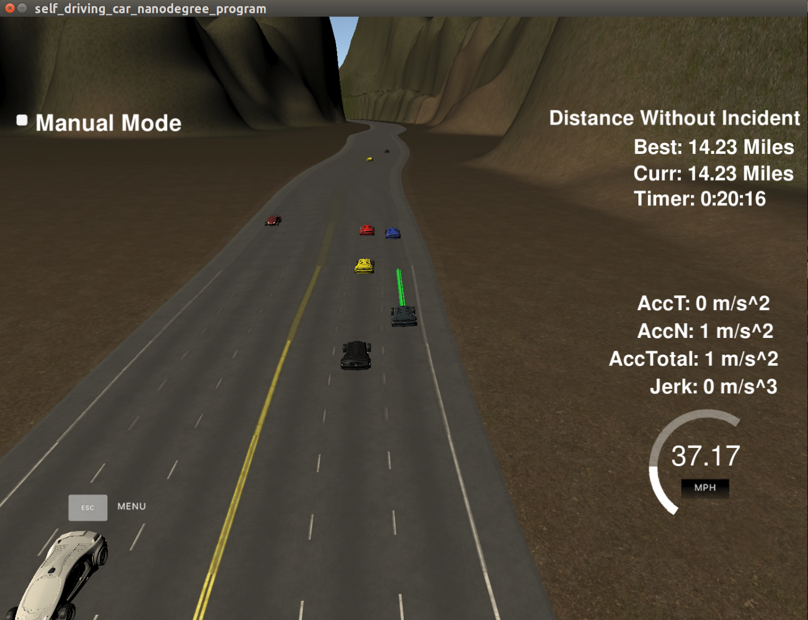

# Path planning

## Goal
In this project your goal is to safely navigate around a virtual highway with other traffic that is driving +-10 MPH of the 50 MPH speed limit. You will be provided the car's localization and sensor fusion data, there is also a sparse map list of waypoints around the highway. The car should try to go as close as possible to the 50 MPH speed limit, which means passing slower traffic when possible, note that other cars will try to change lanes too. The car should avoid hitting other cars at all cost as well as driving inside of the marked road lanes at all times, unless going from one lane to another. The car should be able to make one complete loop around the 6946m highway. Since the car is trying to go 50 MPH, it should take a little over 5 minutes to complete 1 loop. Also the car should not experience total acceleration over 10 m/s^2 and jerk that is greater than 10 m/s^3.

## Architecture
The architecture for path planning follow pretty much what was discussed in the class.

An in-memory pubsub is used to communicate between components. They all work independently and only depends on messages available from the pubsub.

### Localization
Localization module is a simple wrapper to needed data structures because ground truth data is provided from the simulator.

### Prediction
Prediction module is responsible to predict where all other car states. This data is made available on pubsub.

### Behaviour planner
Behaviour planner module is responsible for producing target lane and velocity of the main vehicle. This module takes as input localization and prediction. Responsibilities include lane keeping, passing avoiding collisions etc. This module performs a naive optimization that chooses the behaviour that maximizes velocity.

### Trajectory planner
Trajectory planner is responsible for planning a trajectory from vehicles current state to the target state requested by beheviour planner. This modules takes as input localization and behaviour planner output and produces a path that the car would follow. Path is basically a vector of waypoints. Current implemetation is a simple spline interpolator from current state to target state such that the required constraints are met. This module could be improved to generate jerk minimizing trajectory.

## Additional changes
Conversion from Frenet to XY given as part of starter code is not continuous. Change was made to make it continuous using a spline.

## Result

The car successfully completed multiple laps while maintaining all constraints.

1. Completed > 4.23 miles without incident.
2. Does not drive faster than 50mph (max is set to 48mph).
3. Does not exceed acceleration of 10m/s^2 and jerk of 10m/s^3
4. No collisions
5. Performs lane change to move faster. 
